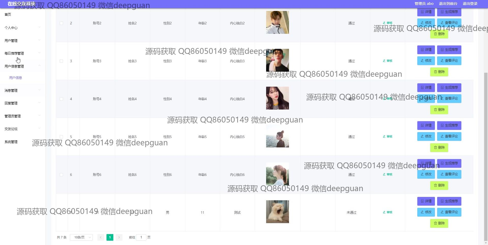
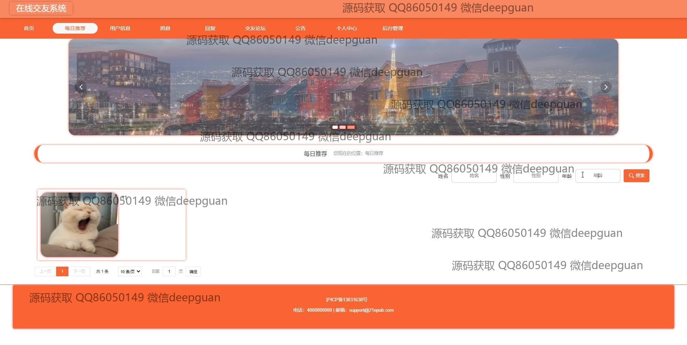

<h1 align="center">在线交友系统+vue</h1>

## 简介
在线交友系统：角色分为管理员、用户；支持用户信息管理、好友推荐、即时聊天、动态发布、消息管理等核心功能，界面简洁易用，提升社交互动体验。    --计算机毕业设计源码；毕设源码；java毕业设计源码

## 联系方式

<h3 align="center">获取完整代码与数据库文件 + 微信：bysj5151 QQ: 86050149 QQ群: 783742310</h3>

<h3 align="center">可帮忙远程部署 包运行成功！提供远程部署、修改代码、设计文档指导、代码讲解等服务！</h3>

## 功能介绍（完整见运行截图）
管理员：管理员可以进行网站的整体管理，包括用户注册信息的审核与修改，消息管理，用户评论管理和内容推荐以及系统公告管理。后台管理界面允许管理员对用户进行增删改查操作，查看并编辑用户信息，监控网站活跃度和用户互动。通过轮播图管理模块，管理员能上传、删除或修改首页展示的图片，确保更新及时且内容准确。同时，管理员有权限使用系统管理模块查看系统日志及维护系统设置。管理员需确保系统的安全运行，并支持用户反馈以提升用户体验。

用户：用户通过注册和登录可以访问个人中心，修改个人信息如账号、密码、头像等，并参与即时聊天和动态发布。用户界面提供消息交流、每日推荐、交友论坛等功能，用户可以通过搜索功能寻找潜在的交友对象，并根据系统推荐进行互动交流。用户还可浏览其他用户的资料，查看其基本信息及在线状态，并进行评论及消息发送。平台提供好友管理功能，用户能随时查看并编辑好友列表。此外，用户可以通过前端界面上传个人生活照片和分享动态，丰富个人主页的展示内容。

新用户：新用户可通过注册界面输入基本信息完成注册，注册后便可使用完整的系统功能。注册过程包括填写账号、密码、姓名、年龄、联系信息等，确保账户的唯一性和安全性。新用户注册成功后，系统将提供个性化的用户体验，通过兴趣推送交友推荐和互动信息。新用户可以根据自身需求调整个人资料设置，加入公开论坛和讨论区以加快融入社群的过程。新用户需遵守平台规则进行互动，并通过不断完善个人资料来提升交友机会。

开发者：开发者主要负责系统的开发和优化，采用SSM框架和Vue技术构建整个前后台功能。开发者需定期维护系统代码，修复潜在的漏洞和升级系统功能模块。通过优化数据库查询和前端交互，提升页面加载速度与用户操作响应。开发者需根据用户反馈和管理员建议对系统进行功能更新或界面调整，以保证平台的稳定与良好的用户体验。定期测试和迭代开发是确保交友平台功能正常运行和用户持续增长的关键。

## 运行截图

本代码来源于网络,仅供学习参考使用!

